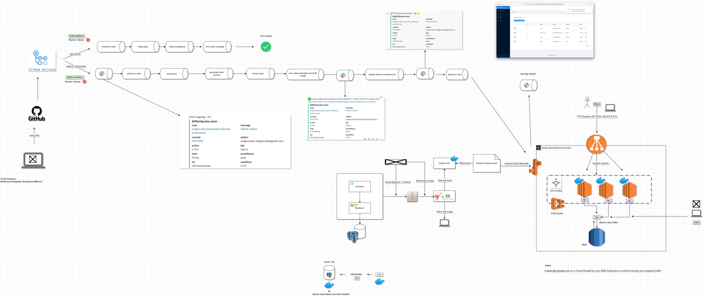
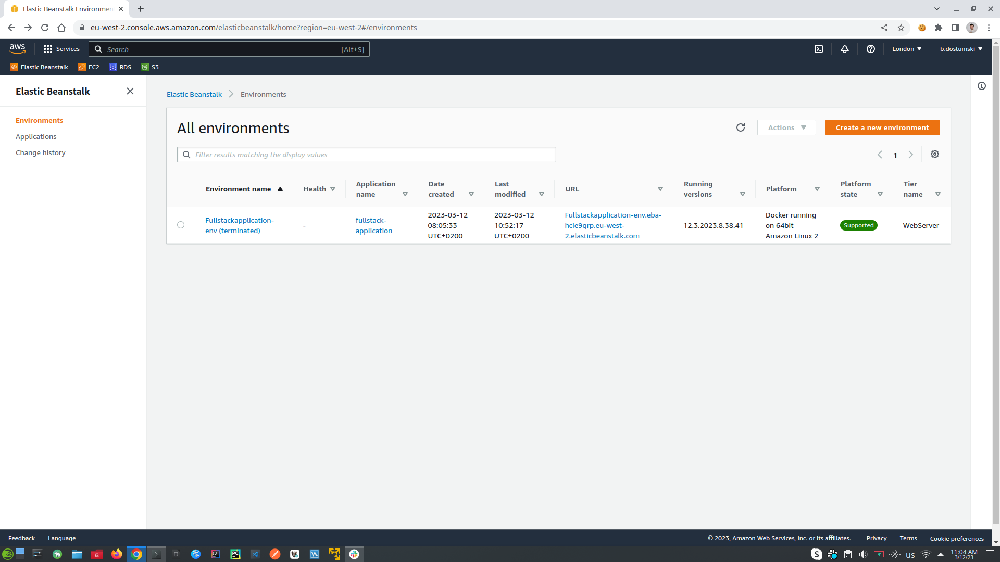
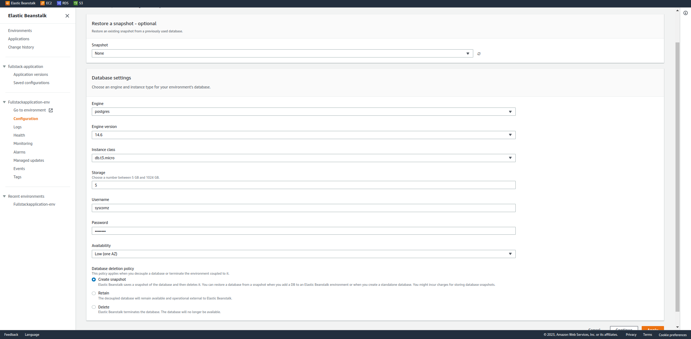
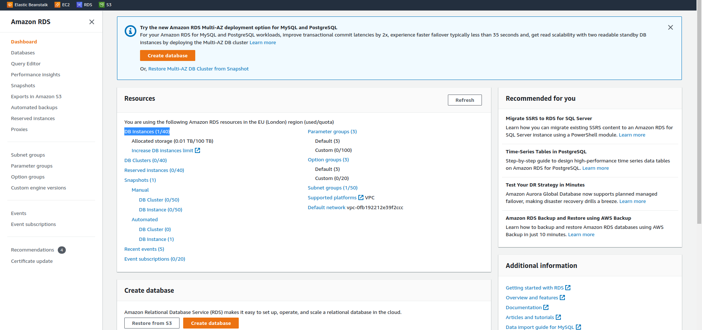
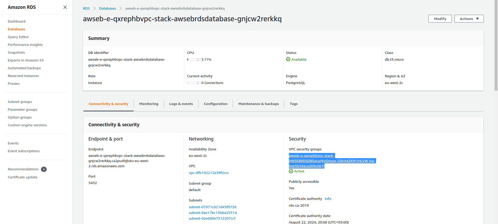
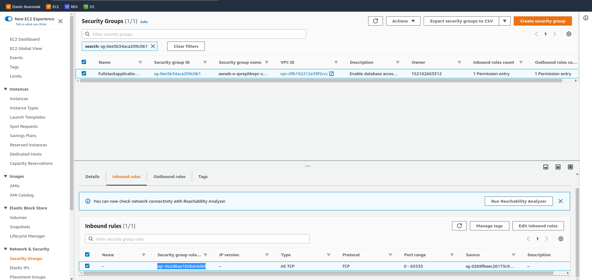
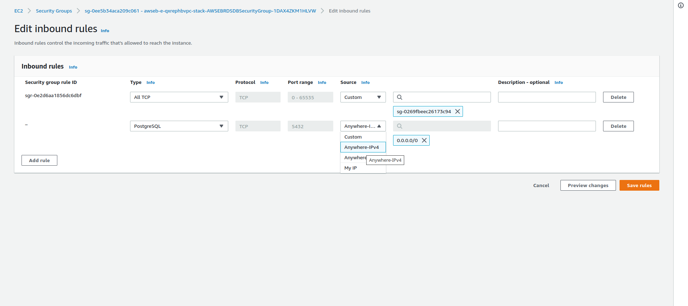
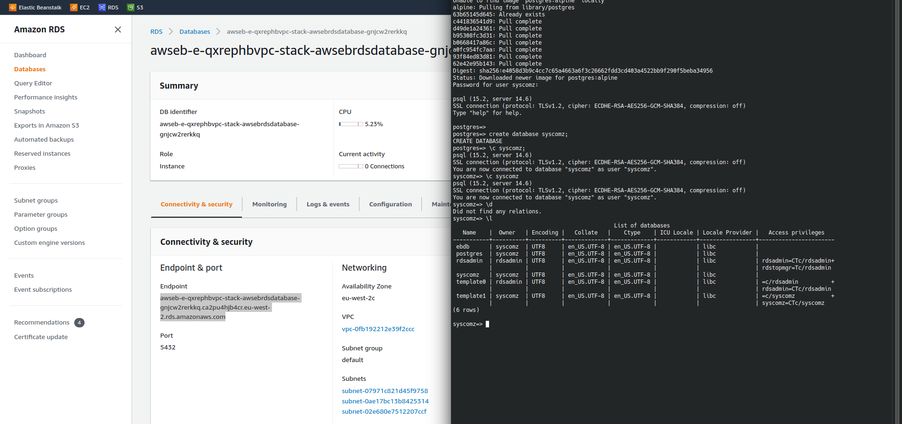
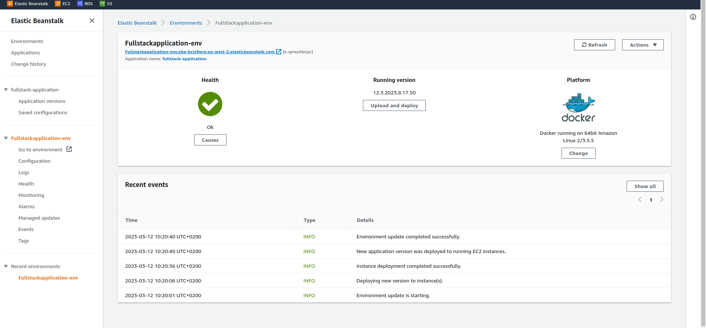

# Full Stack Spring Boot & React Application

## Software Description

This application is a full stack web application that integrates Spring Boot for the backend API and React.js for the frontend. It aims to provide a seamless integration of these technologies to deliver a robust and scalable web application.

This project was greatly influenced by the guidance and tutorials provided by Amigoscode. Their clear and comprehensive resources were instrumental in the development and success of this project.

## Software Architecture Description

-   **Spring Boot Backend API**: Provides RESTful web services and handles business logic.
-   **Frontend with React.js Hooks and Functions Components**: Manages the user interface and client-side interactions.
-   **Maven Build Tool**: Automates the build process for both frontend and backend.
-   **Databases using Postgres on Docker**: Utilizes PostgreSQL as the database, running on Docker to ensure consistency across environments.
-   **Spring Data JPA**: Facilitates data access and manipulation using Java Persistence API.
-   **Server and Client Side Error Handling**: Implements comprehensive error handling mechanisms on both server and client sides.
-   **Packaging applications for deployment using Docker and Jib**: Streamlines the process of packaging and deploying the application as Docker containers.
-   **AWS RDS & Elastic Beanstalk**: Leverages AWS services for database management and application deployment.
-   **Software Deployment Automation with GitHub Actions**: Automates the deployment pipeline using GitHub Actions.
-   **Software Deployment Monitoring with Slack**: Integrates Slack for real-time monitoring and alerts on the deployment status.

### Software Architecture Image

### AWS and Elastic Beanstalk Deployment

Elastic Beanstalk facilitates the deployment and scaling of web applications through an end-to-end management service. To deploy an application, create a `docker-compose.yaml` file and upload it to Elastic Beanstalk. This environment provisions resources like a load balancer, auto-scaling groups, and an ECS cluster containing EC2 instances, which serve as virtual cloud servers, along with an RDS database system.

When a request is made to the application, it is routed through the load balancer, which distributes the load across available EC2 instances. These instances access the RDS database to process requests. Deployment begins by selecting the `./elasticbeanstalk/docker-compose.yaml` file from the local environment. Within the EC2 console, one can view application configurations such as instances, images, Elastic Block Store (EBS), network and security settings, load balancing, and auto-scaling.

)

Deployment strategies vary, with one method bundling the backend (BE) and frontend (FE) into a single Jar file, while another segregates BE, FE, and other services into individual applications, managed by Kubernetes for scaling. Elastic Beanstalk is best suited for simpler applications; more complex solutions may require alternative approaches. To avoid AWS charges, terminate the environment when not in use.

### Database Configuration and Spring Data JPA

Start by creating a Docker network named `db`. Then, on the local machine, establish a directory (`db-data`) to hold data from the Docker container. Initiate a Postgres container within the `db-data` folder, and connect to it using a separate `psql` container within the same network. For production, AWS’s RDS service is preferred over local Docker containers.

To configure the database in Elastic Beanstalk, navigate to the application environment’s configuration tab and set up the database parameters. For development, create an `application-dev.properties` file and activate it by setting the `SPRING_PROFILES_ACTIVE=dev` environment variable. AWS RDS databases are safeguarded by Security Groups, ensuring only authorized instances or specified IP addresses can access them.

### Deployment and CI/CD Processes(Work  in Progress)

For deployment, log into Docker, perform a clean build, bundle the application components, and push the Docker image to DockerHub. The CI/CD pipeline involves code creation, pushing to GitHub, and executing GitHub Actions for pull requests and merges. The build workflow includes code checkout, Java and PostgreSQL setup, and package compilation. Deployment workflows send notifications, handle Docker logins, image building, and update Elastic Beanstalk configurations.

To facilitate CI/CD notifications, integrate Slack through app creation and webhook configuration. Also, establish AWS credentials for automated Elastic Beanstalk deployments by creating a programmatic access user within AWS and adding the access keys to GitHub secrets.

### Testing(Work  in Progress)

Unit and integration testing form the core of the application’s quality assurance. Utilize JUnit5 for unit testing and the Failsafe plugin for integration tests, focusing on positive test paths. AssertJ enhances assertions and test readability. For integration testing, the H2 in-memory database provides a temporary testing environment.

## Cheat Sheet for Copy - Paste

Commands and tasks that are commonly used during development, building, and deployment of the application.

### NPM

-   `npm install`: Install all dependencies from `package.json` into `node_modules`.
-   `npm install --save [dependency@version]`: Install a new dependency with the specified version.
-   `npm run build`: Build the frontend application, creating a `build` directory.
-   `HOST=0.0.0.0 npm start`: Run the frontend project on a specified host.

### Java

-   `java -jar file.jar`: Run a JAR file from the `target` folder.

### Maven (mvnw)

-   `./mvnw clean`: Delete the `target` folder.
-   `./mvnw install`: Create the `target` folder and build the project using the active profile.
-   `./mvnw clean install`: Clean and then build the project.

### Maven, Profiles, and Automation

-   Frontend Maven Plugin: Automates the integration of the frontend build process with Maven.
-   Maven Resources Plugin: Automates copying the frontend build output to the backend resources directory.

### Docker and Jib

-   Jib builds Docker and OCI images for Java applications without a Docker daemon.
-   `./mvnw jib:dockerBuild -Djib.to.image=image-name:version`: Build a local Docker image with Jib.
-   `./mvnw clean install jib:dockerBuild -Djib.to.image=image-name:version`: Build a JAR and then a Docker image if the JAR is missing.
-   `./mvnw clean install jib:build -Djib.to.image=repository/image-name:tag`: Build and push the image to a Docker registry.
-   `docker login`: Log in to a Docker registry.
-   `docker image ls`: List Docker images.
-   `docker ps`: Show running Docker containers.
-   `docker run --name image-name -p port:port image:version`: Run a Docker container.
-   `docker pull image:version`: Pull an image from a Docker registry.

### Docker and Databases

-   `docker network create db`: Create a Docker network for database communication.
-   `docker run --name db -p port:port --network=db -v "/path/to/database-dir:/var/lib/postgresql/data" -e POSTGRES_PASSWORD=password -d postgres:alpine`: Run a PostgreSQL container.
-   `docker run -it --rm --network=db postgres:alpine psql -h db -U postgres`: Connect to a PostgreSQL database container.
-   `docker run -it --rm postgres:alpine psql -h host -U user -d database`: Connect to a remote PostgreSQL database, such as AWS RDS.
-   `docker ps -a`: List all Docker containers.
-   `docker rm -f container-name`: Force remove a running container.
-   `docker run --rm --name image-name -p port:port image:version`: Run a Docker container and remove it on exit.
-   `docker network rm db`: Remove a Docker network.
